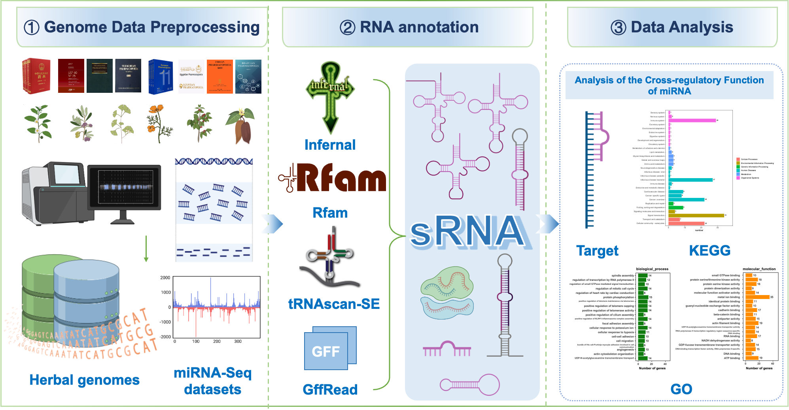

# Data Processing Pipeline for Small RNA Analysis

## Pipeline Workflow

### 1. Data Download

Retrieve datasets from the following sources:
- [NCBI](https://www.ncbi.nlm.nih.gov/)
- [1K-MPGD](http://www.herbgenome.com/)

### 2. Pre-processing for miRNA-seq

- TBtools_JRE1.6.jar biocjava.sRNA.Tools.sRNAseqAdaperRemover Settings "-- minLen 17", remove the miRNA-seq sequencing data downloaded from NCBI joint sequence, And the reads with the same sequence are merged to deredundant.
- miRDeep2 (version 2.0.1.2) software was used for miRNA prediction based on genome sequences and miRBase (version 22.1) database.
- gffread software (version 0.12.7), based on genome structure annotation GFF files, accurately extracts gene sequences from genome sequences

### 3. miRNA 靶基因预测

- psRobot software (version 1.2) was used to analyze the complementary pairing between miRNA sequences and target gene mRNA sequences to search for potential binding sites. At the same time, the software will evaluate the secondary structure of the target gene, and by calculating the free energy of miRNA binding to the target gene, select the target gene with higher binding stability and closer to the real situation.
- RNAhybrid software (version 2.1.2) was used to predict the target genes of miRNA in species human. The software analyzes the complementary pairing between the miRNA sequence and the target gene mRNA sequence to search for potential binding sites.
- the kofam_scan tool (ftp://ftp.genome.jp/pub/tools/kofam_scan) was used for functional annotation of the miRNA target gene KEGG; GO functional annotation was performed using diamond against the UniProt database, which was used to obtain GO functional annotation information through the corresponding GO annotation information of the proteins in the UniProt database. The GO functional annotation was performed by using the GO annotation information of proteins in the UniProt database.

### 4. Denovo predicts Small RNA

-  Rfam database (version 14.10) and INFERNAL software (version 1.1.4) were used to perform ncRNA prediction on genomic sequences