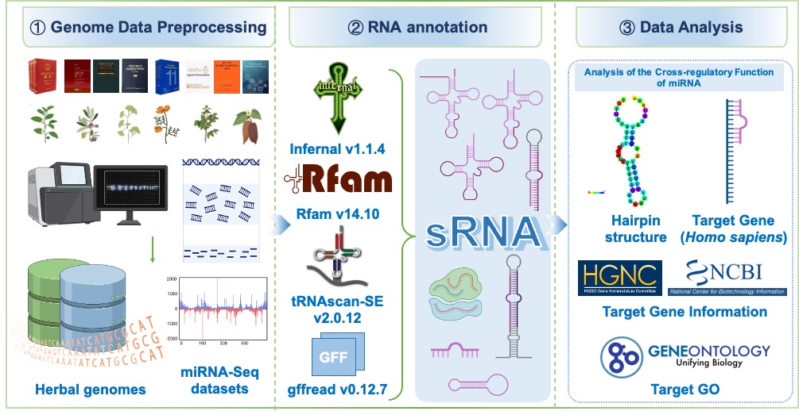

# Data Processing Pipeline for Small RNA Analysis

## Pipeline Workflow

### 1. Data Download

Retrieve datasets from the following sources:
- [NCBI](https://www.ncbi.nlm.nih.gov/)
- [1K-MPGD](http://www.herbgenome.com/)
- [TCMPG](https://cbcb.cdutcm.edu.cn/TCMPG/)

### 2. Genome predicted Small RNA

-  Rfam database (version 14.10) alongside INFERNAL software (version 1.1.4) were used for ncRNA prediction. High-confidence predictions were further refined to extract snRNAs and miRNAs. The parameters used for Rfam were "-cut_ga -rfam -nohmmonly -fmt 2", while INFERNAL was executed with "cmscan -cut_ga -nohmmonly -cpu 16 --tblout out.tblout -fmt 2 -clanin Rfam.clanin -rfam Rfam.cm genome.fa". For tRNA sequence characterization, tRNAscan-SE (version 2.0.12) was employed with the parameters "-E -j tRNA.gff -o tRNA.result -f tRNA.struct". Additionally, rRNA prediction was conducted using rRNAmmer (version 1.2) with the parameters "-S euk -m tsu, lsu, ssu".

### 3. Pre-processing for miRNA-seq

- The tBtools_JRE1.6.jar biocjava.sRNA.Tools.sRNAseqAdaperRemover software was used to remove splice sequences from the sequencing data, followed by merging and de-redundancy of reads with identical sequences using the parameter "--minLen 17".
- Based on the genome annotations provided in the GFF file, gffread (version 0.12.7) was utilized to extract gene sequences from the genome. 
- miRDeep2 (version 2.0.1.2) software was used for miRNA prediction based on genome sequences and miRBase (version 22.1) database.

### 4. Annotation of miRNA target genes

- RNAhybrid (version 2.1.2) was used to analyze the complementary pairing patterns between miRNA sequences and target mRNA sequences to identify potential binding sites.
- The secondary structure of target genes was evaluated and binding stability was assessed by calculating the free energy of miRNA target interactions. High confidence targets with enhanced binding stability and biological relevance were prioritized for further analysis.
- For functional annotation, the functions of miRNA target genes can be accessed through the Human Genetics website (https://www.genenames.org/), and GO function annotation information is also available. 
- For miRNA target genes that are ncRNAs, more information is available through the National Center for Biotechnology Information (NCBI）(https://www.ncbi.nlm.nih.gov/gene/).

